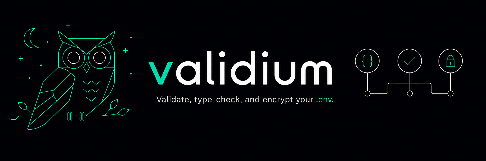
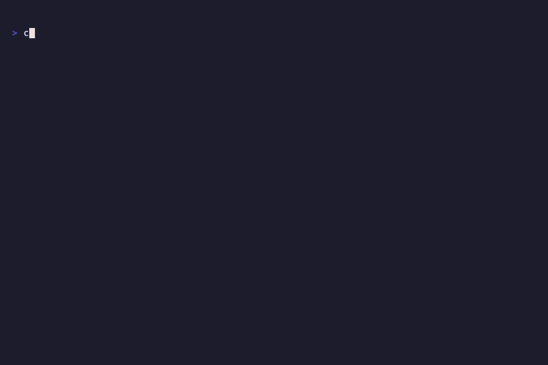

<p align="center">
  
</p>

> `.env` validation, done right.

[](https://github.com/franium/validium/actions/workflows/ci.yml)
[](https://goreportcard.com/report/github.com/franium/validium)
[](https://go.dev/)
[](LICENSE)

A CLI tool that validates `.env` files against a typed schema. It catches missing variables, wrong types, and malformed values — before they break your app in production.



## Table of Contents

- [Why validium?](#why-validium)
- [Quick Start](#quick-start)
- [Installation](#installation)
- [Commands](#commands)
- [Workflow](#workflow)
- [CI Integration](#ci-integration)
- [Sharing secrets safely](#sharing-secrets-safely)
- [Schema: `validium.json`](#schema-validiumjson)
- [Fallback: `.env.example`](#fallback-envexample)
- [Development](#development)

## Why validium?

`.env.example` only tells you which keys should exist — not whether the values in `.env` actually make sense. A `PORT` set to `abc`, a `DATABASE_URL` that isn't a URL, or a required `API_KEY` left empty all pass a plain existence check and still blow up at runtime.

validium closes that gap with a typed schema (`validium.json`):

- **Real validation, not just presence checks** — types, ranges, choices, and format rules (`url`, `email`, integer/float ranges, string enums, ...) catch bad values before your app boots or your CI pipeline deploys.
- **Schemas grow with your project** — they're not write-once. Whenever you introduce a new variable, run `validium add VARIABLE_NAME` and walk through its type, required/secret flags, and constraints interactively; validium writes it straight into `validium.json` for you, no hand-editing JSON or regenerating from scratch.
- **One source of truth** — generate `.env.example` directly from the schema with `validium generate`, so your example file and your validation rules never drift apart.
- **Safer sharing** — encrypt `.env` for teammates with built-in `age` encryption (`keygen`/`encrypt`/`decrypt`), no external binary required.

## Quick Start

```bash
# 1. Install
go install github.com/franium/validium/cmd/validium@latest

# 2. Generate a typed schema from your current .env
validium init

# 3. Validate any time
validium check
```

That's it. Keep reading to learn how to refine your schema, generate `.env.example`, and integrate with CI.

## Installation

```bash
go install github.com/franium/validium/cmd/validium@latest
```

Or build from source:

```bash
git clone https://github.com/franium/validium
cd validium
go build -o validium ./cmd/validium
```

**Requirements:** Go 1.26+
## Commands

| Command    | Description |
|------------|-------------|
| `init`     | Reads your `.env` and generates a `validium.json` schema. Fails if `.env` is missing or `validium.json` already exists. |
| `check`    | Validates `.env` against `validium.json`. Falls back to `.env.example` if no schema is found. |
| `generate` | Generates `.env.example` from `validium.json`. Requires `init` to have been run first. Overwrites an existing `.env.example`. |
| `add`      | Adds a new variable to `validium.json` interactively. Requires `init` to have been run first. |
| `keygen`   | Generates a local age identity (`.validium.key`) and prints its public key. |
| `encrypt`  | Encrypts `.env` to `.env.age` for one or more age recipients (public keys). |
| `decrypt`  | Decrypts `.env.age` back to `.env` using an age identity file. |
| `help`     | Prints usage information. |

## Workflow

```bash
# 1. Generate the schema from your current .env
validium init

# 2. Open validium.json and refine types, required flags, secrets, etc.

# 3. Generate .env.example from the schema — commit this, not your .env
validium generate

# 4. Validate .env in CI or on pre-commit
validium check

# 5. Need a new variable later? Register it interactively —
#    validium walks you through its type, required/secret flags, and constraints
validium add NEW_VARIABLE
```

Keep `.env.example` always in sync with a pre-commit hook:

```bash
validium generate && git add .env.example
```

## CI Integration

Add `validium check` to your pipeline to validate environment variables before deployment:

```yaml
# .github/workflows/ci.yml
- name: Validate .env
  run: |
    go install github.com/franium/validium/cmd/validium@latest
    validium check
```

`check` exits with code `1` on any validation failure, making it safe to use as a pipeline gate.

### Exit Codes

| Code | Meaning |
|------|---------|
| `0`  | All variables are valid |
| `1`  | One or more validation errors |

## Sharing secrets safely

Need to hand your `.env` to a teammate without pasting secrets into Slack? validium has built-in [age](https://age-encryption.org) encryption — no external binary required, it's embedded in the tool.

```bash
# 1. Your teammate generates a keypair and shares their public key with you
validium keygen
# -> Identity written to .validium.key.
# -> Public key: age1ql3z7hjy54pw3hyww5ayyfg7zqgvc7w3j2elw8zmrj2kg5sfn9aqmcac8p

# 2. You encrypt .env for their public key
validium encrypt age1ql3z7hjy54pw3hyww5ayyfg7zqgvc7w3j2elw8zmrj2kg5sfn9aqmcac8p
# -> .env has been encrypted to .env.age.

# 3. Send them .env.age (safe to share). They decrypt it with their identity
validium decrypt .validium.key
# -> .env.age has been decrypted to .env.
```

- `keygen` refuses to overwrite an existing `.validium.key` — your private key is never clobbered.
- `encrypt` accepts multiple recipients, so you can encrypt for a whole team at once: `validium encrypt age1... age1... age1...`
- `encrypt` writes `.env.age` through a temporary file before replacing the final ciphertext. Replacement is atomic on Unix-like systems; on Windows it is best effort because filesystem rename guarantees differ.
- **Never commit `.validium.key` or `.env`.** Only `.env.age` (the ciphertext) is safe to share or store.

## Schema: `validium.json`

`validium init` generates this file from your current `.env`. Edit it to add types, constraints, and metadata:

```json
{
  "version": "0.1.0",
  "variables": {
    "DATABASE_URL": {
      "type": "url",
      "description": "Main database connection string",
      "required": true,
      "secret": true,
      "default": null
    },
    "PORT": {
      "type": "integer",
      "description": "HTTP server port",
      "required": false,
      "secret": false,
      "default": 8080
    },
    "API_BASE": {
      "type": "url-http",
      "description": "External API base URL (must be HTTPS)",
      "required": true,
      "secret": false,
      "default": "https://api.example.com",
      "conditions": { "https": true }
    },
    "DEBUG": {
      "type": "boolean",
      "description": "Enable debug mode",
      "required": false,
      "secret": false,
      "default": false
    }
  }
}
```

### Variable fields

| Field         | Type      | Description |
|---------------|-----------|-------------|
| `type`        | `string`  | One of `string`, `integer`, `float`, `boolean`, `url`, `url-http`, `email` |
| `description` | `string`  | Human-readable description of the variable |
| `required`    | `boolean` | If `true`, `check` fails when the value is empty |
| `secret`      | `boolean` | Masks the value in error output |
| `default`     | `any`     | Default value shown in `.env.example`; informational only — `check` does not apply it as a fallback |
| `conditions`  | `object`  | Extra constraints per type (see below) |

### Conditions

| Type       | Supported conditions |
|------------|---------------------|
| `string`   | `{"choices": ["dev", "staging", "prod"]}` — value must be one of the listed options |
| `url-http` | `{"https": true}` — restricts to `https://` only |
| `integer`  | `{"min": 1, "max": 100}` — inclusive range check |
| `float`    | `{"min": 0.0, "max": 1.0}` — inclusive range check |

For `integer` and `float`, both `min` and `max` are optional; omit either to leave that bound unconstrained. For `string`, an empty or omitted `choices` list allows any value.

Example — a numeric range:

```json
"PORT": {
  "type": "integer",
  "required": true,
  "conditions": { "min": 1, "max": 65535 }
}
```

Example — a fixed set of allowed string values:

```json
"APP_ENV": {
  "type": "string",
  "required": true,
  "conditions": { "choices": ["dev", "staging", "prod"] }
}
```

> **Tip:** `validium add` will ask whether a `string` variable has allowed choices and let you enter them as a comma-separated list — no need to hand-edit `validium.json`.

### Type validation

| Type       | Validated as |
|------------|-------------|
| `string`   | Any non-empty string. Restrict to a fixed set with `conditions: {"choices": [...]}` |
| `integer`  | Parseable as a whole number |
| `float`    | Parseable as a decimal number |
| `boolean`  | `true` or `false` |
| `url`      | Any valid URI (e.g. `https://example.com`, `ftp://host`) |
| `url-http` | Must start with `http://` or `https://`. Use `conditions: {"https": true}` to restrict to `https://` only. |
| `email`    | Valid email address format |

> **Type inference note:** `validium init` uses heuristics to infer types. Values like `/some/path` are classified as `string`, not `url` — change the type manually in `validium.json` if needed.

## Fallback: `.env.example`

If `validium.json` is not found, `check` falls back to `.env.example` and verifies that every key defined there exists in `.env`. No type validation is applied in fallback mode.

Run `validium init` to graduate from `.env.example` to a full typed schema.

## Development

### Regenerating the demo GIF

The demo (`assets/demo.gif`) is generated from `demo.tape` with [VHS](https://github.com/charmbracelet/vhs). VHS requires `ffmpeg` and `ttyd` to render:

```bash
# macOS
brew install vhs ffmpeg ttyd

# Build and install the binary so the tape can find it on $PATH
go install ./cmd/validium

# Render the GIF
vhs demo.tape
```

The tape assumes `validium` is available on `$HOME/go/bin` (the default `go install` target).
